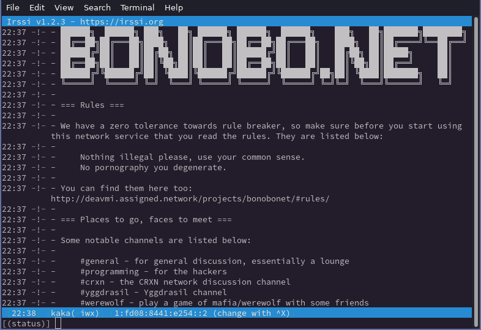

BonoboNET
=========

### _The community run IRC network for hackers_

---

## What is BonoboNET?

**BonoboNET** is an IRC or _Internet Relay Chat_ network that lets people and communities get together and chat in groups (_channels_) or in one-to-one conversations
(_private messages_). The topics for discussion range from programming, to politics, networking and memes. All are welcome to join as long as they follow the [**Rules**](rules.md).
The network is maintained by the community, especially these [People](people.md).

We have servers running all around the world and connecting is as easy as pointing your favorite IRC client to one of them listed on the [Servers](servers.md) page.

We offer Atheme-based services such as:

1. `ChanServ`
	* This lets you register and manage channels
2. `NickServ`
	* This lets you register and manage your user account
3. `HostServ`
	* This lets you change your hostmask associated with
	your logins

## Want to join us?

Come and login and then head on over to `#bnet` or `#general` and we can get you started with any further questions or just chit-chat.

Want to find some more rooms? Type `/list` to get a list of channels.

## Join our IRC network!

Getting connected is very easy to do. Simply head on over to our [Servers](servers.md) page
to find a list of servers available which you can use to connect to our network!

Before you do so, please make sure you [**read the rules**](rules.md).

---

<i>The coolest kids on the block</i>

